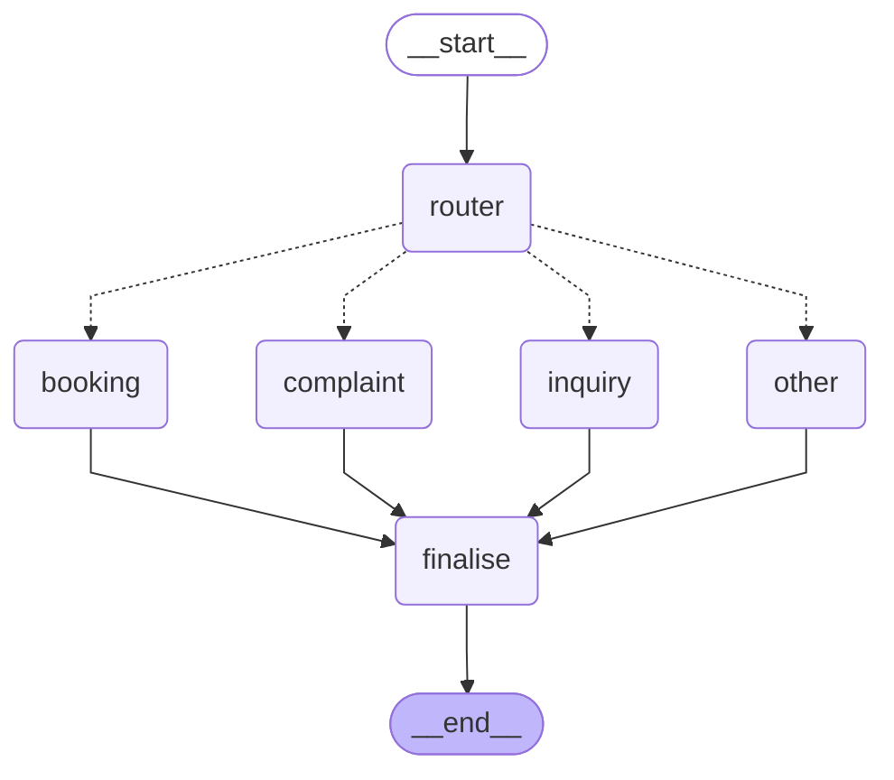

# Architecture

Generated by `python -m scripts.draw_graph --write`. Do not edit by hand.

## Request flow

## Nodes

| Node | Responsibility |
| --- | --- |
| `router` | Classifies intent. Keyword fast-path for pleasantries, small LLM otherwise. Sets `intent`, `secondary_intent`, `confidence`. |
| `inquiry` | Answers from retrieved documents, or refuses. Never answers from model knowledge. |
| `booking` | Extracts appointment details, checks availability, writes to the calendar. |
| `complaint` | Assesses severity, logs the complaint, escalates by rule. |
| `other` | Greetings, thanks, and messages outside the clinic's scope. |
| `finalise` | Appends any secondary-intent note and assembles the turn record for analytics. |

Every path converges on `finalise`, so logging happens in one place
rather than at five call sites.
