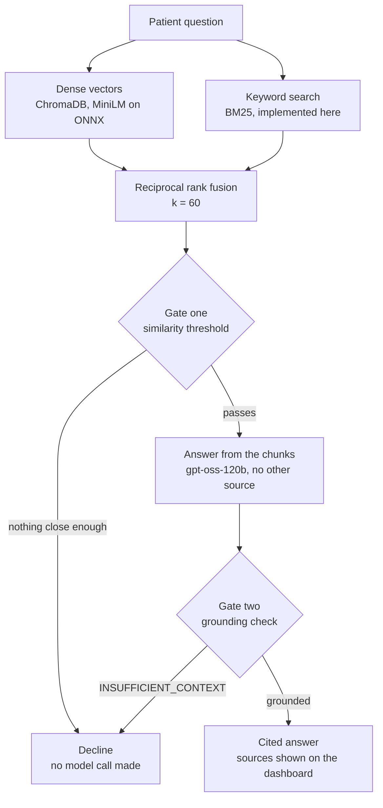
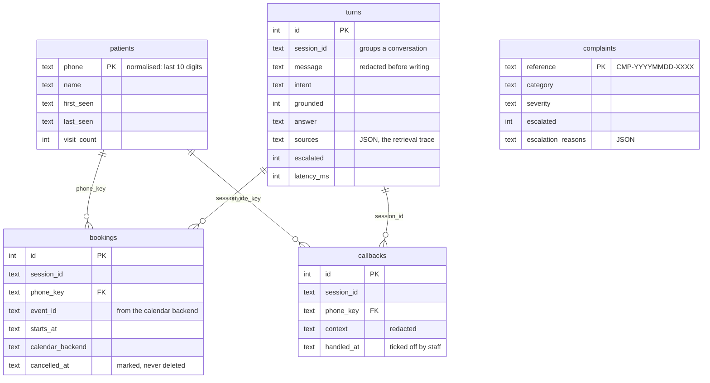

# Diagrams

Two views that the graph diagram does not show: what happens *inside* the
Inquiry Agent, and what ends up on disk.

The request flow itself lives in [architecture.md](architecture.md) and is
generated from the compiled graph by `python -m scripts.draw_graph --write`,
so it cannot drift from the code. These two are maintained by hand, which
is the trade: they describe decisions rather than structure, and no tool
can read a decision out of the source.

## Retrieval and grounding

The part that makes the assistant safe to put in front of patients. Two
independent gates can stop an answer, and they fail differently on
purpose: the first is arithmetic on similarity scores and costs nothing,
the second is the model reading its own context and costs a call.

A question that clears the threshold and still cannot be answered from
the retrieved sections is the interesting case — it is why the second
gate exists. The first gate alone let a question about a cinema's opening
times through at 0.422, because it is topically close to a laboratory's
opening times.

A compound question is retried half by half before the decline stands:
"what are your hours and where are your branches" scores well enough to
retrieve, then the model refuses because the context answers only half of
it. Each half is retrieved for and answered separately, and the halves
that can be answered are joined.

## Analytics schema

SQLite. Five tables, no foreign keys — deliberately, because the write
path must never fail on a constraint while someone is waiting for a
reply. The joins are by convention and they are documented here instead.

**Complaints have no `session_id`.** They are keyed by the reference the
patient is given, because that is what someone quotes on the phone three
weeks later, and the complaint has to be findable from that alone. The
conversation it came from is reachable the other way: the turn's metadata
carries the reference.

**Phone numbers are stored twice** on `bookings` and `callbacks`: as the
patient typed them, for display, and as a normalised key, for matching.
Without the key, "(503) 555 0180" and "503-555-0180" are two different
people.

**`turns.message` is redacted; `bookings.phone` is not.** Analytics wants
to know *what* was asked, not *who* asked, so contact details are stripped
at that write boundary. A booking is a different thing: the number is a
field the practice has to be able to dial.
